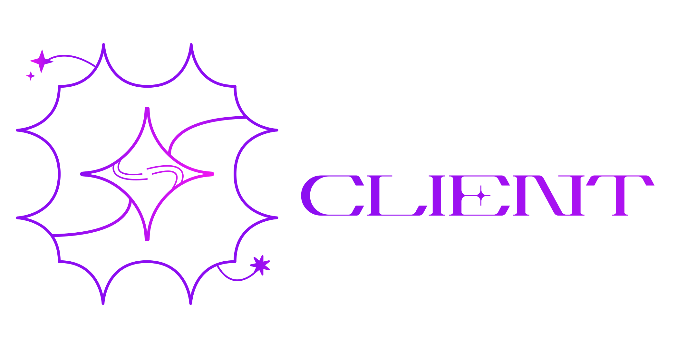

    

<h1 align="center">Nebula 1.7.2</h1>
<h3 align="center">Nebula is a utility/hack client modification for Minecraft Vanilla 1.7.2</h3>

### Features

- OptiFine HD U F7
- World Downloader Mod
- Wide arrangement of utility & PvP features
- Sophisticated GUI & HUD elements

### Credits

- [bushtranslator](https://github.com/therealbush/translator) - translation API help
- [Cosmos & Linus](https://github.com/momentumdevelopment/cosmos) - Shader ESP
- [Doogie13](https://github.com/Doogie13) - information on movement related modules
- [MEDMEX](https://github.com/KingYeezus) - help/information on older versions of minecraft
- [hometea](https://github.com/h0metea) - Images & GFX (seen in the `README.md` and in the client!)

### Building

1. Clone via git (very important step)
2. Open in IntelliJ
3. Sync & let gradle download libraries in IntelliJ
4. Run the build task
5. build/libs
6. enjoi

---
<h5 align="center">Made with ♥ by Aestheticall - 2023</h5>
