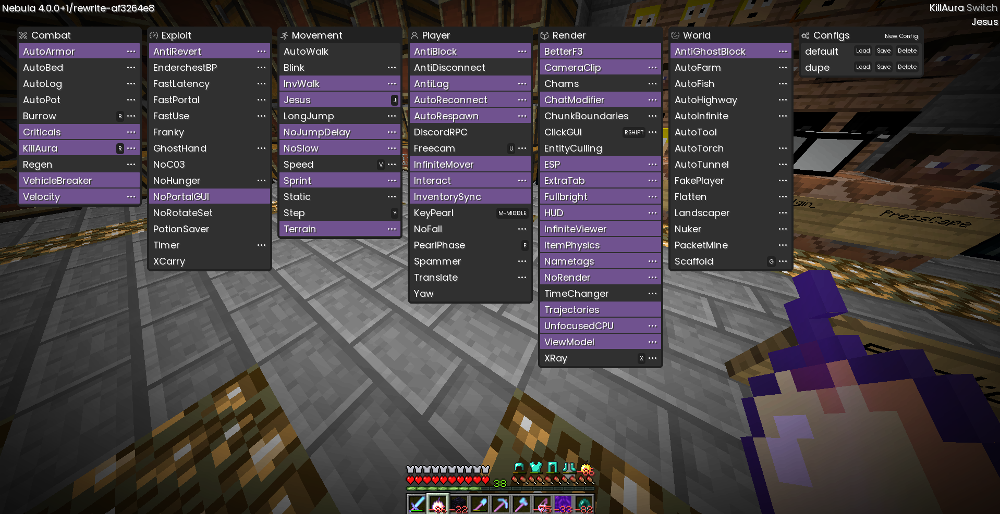

# nebula-1.7.2

cool kid on the block

join up:
https://discord.gg/nrsg2u4GtP

---

## OSS / Code Usage

If you'd like to use Nebula-1.7.2 code (or fork it), I request that:

1. It's public & accessible to everyone (I like looking at peoples forks of my projects)
2. Directly credits me (xgraza) or the project (Nebula-1.7.2) if code from this repository was used (other than forge
   mods ported into the project, credit them)
3. Must not be commercially sold

If you have any questions of the codebase, you may join the discord and ask. Yes, I know it's not perfect and I've made
some poor decisions here and there, but life is a dance.

---

## Contributing

Always open to contributions, just your own code please :). Make a PR and I'll look into it.

If you have a suggestion to add an open-source forge mod into the project, you may also suggest, and I'll look into it,
or implement it yourself via a PR.

---

## Building (IntelliJ)

*requires basic knowledge of how to use the IDE & gradle*

> Note: If you are on MacOS and on an M chip series Mac, be sure to install the x86-64 version of your JDK and run via
> Rosetta. You also need to run an older version of java (I'm on 242-b20) so it doesn't tweak when trying to run

1. Clone this repository with git (do NOT download the .zip, it will not build correctly)
2. Extract the content from the .zip downloaded into a folder
3. Open up that extracted folder in IntelliJ
4. Click "Trust Project" if that popup shows up
5. Wait for gradle to sync (you additionally can click the gradle tab and refresh the project to force it to sync)
6. Click into the gradle tab, then go to the build folder and click the build task
7. Compiled archives are available in build/libs/...

Or if you're lazy like me (or do not know how to do the above), check the actions tab or releases tab

---

## Forge Mods Used

- [Schematica](https://github.com/Lunatrius/Schematica/tree/1.7.10) (+ used decomped version for 1.7.2)
- [WDL (World Downloader)](https://github.com/Pokechu22/WorldDownloader/tree/v4)
- [Patcher](https://github.com/Sk1erLLC/Patcher) (used EntityCulling & other improvements)
- [Optifine OptiFine_1.7.2_HD_U_F7](https://optifine.net/downloads)

> I will never make this into a forge mod. The above mods were added by request + QOL, to make up for the fact it's
> not "extendable"

---

## Credits

(no particular order)

- [Gav06](https://github.com/Gav06) - First dude I made a 1.6.4 client with (gavhack-legacy on top!)
- [hometea](https://github.com/h0metea) - GFX in client & testing
- [MedMex](https://github.com/KingYeezus) - Information on exploits
- Captain_S0L0 - Help with beta & really cool guy
- [bush](https://github.com/therealbush/) - Google translate private API params (i love bushbus & bushtranslator!)

---

##### xgraza - 2026