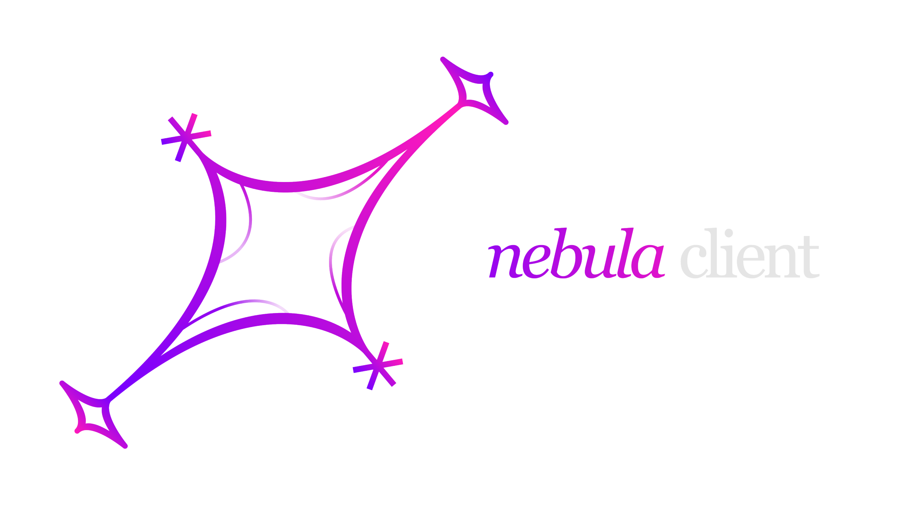

cool kid on the block

join up:
https://discord.gg/nrsg2u4GtP

---

## OSS / Code Usage

If you'd like to use Nebula-1.7.2 code (or fork it), I request that:

1. It's public & accessible to everyone (I like looking at peoples forks of my projects)
2. Directly credits me (xgraza) or the project (Nebula-1.7.2) if code from this repository was used (other than forge
   mods ported into the project, credit them)
3. Must not be commercially sold

If you have any questions of the codebase, you may join the discord and ask. Yes, I know it's not perfect and I've made
some poor decisions here and there, but life is a dance.

---

## Contributing

Always open to contributions, just your own code please :). Make a PR and I'll look into it.

If you have a suggestion to add an open-source forge mod into the project, you may also suggest, and I'll look into it,
or implement it yourself via a PR.

---

## Running Nebula

To run Nebula, I recommend using a third-party launcher such as Prism or MultiMC (or your preferred one). Running with the default Minecraft launcher is possible, but it sucks every time you want to update.

For video instructions, refer to [this video for MultiMC/one of its forks](https://www.youtube.com/watch?v=-Y9J_ghZqfk) or [this video for the official Minecraft Launcher](https://youtube.com/watch?v=kA2sg2YUDyI)

---

## Building (IntelliJ)

> [!NOTE]
> If you are on macOS, you are only able to build with modern Apple Silicon hardware, as the natives for Intel Macs are not included in this repository.

> [!NOTE]
> If you are on Linux, you also will not be able to build, as the natives for Linux are not included in this repository. I will work on getting those natives, so it is possible on Linux in the future. :)

If you do not want to build Nebula, but want to run the latest commit build, [go here](https://github.com/xgraza/nebula-1.7.2/actions) and scroll to download the latest artifact. (requires logging in with a github account)

If you still want to build from source (and or make changes), the instructions are below. 

1. Install a version of Java 8, preferably a modern version. Older versions may break/be unstable/be vulnerable.
2. Download the [client source](https://github.com/xgraza/nebula-1.7.2/archive/refs/heads/rewrite.zip)
3. Unpack `rewrite.zip` with your favorite .zip extractor (WinRaR, 7zip, ArchiveUtility, Windows...)
4. Install & Setup IntelliJ
   1. Once inside the IntelliJ program, open the unpacked folder you downloaded from GitHub
5. Once the folder opens in IntelliJ, there will be a prompt to "Sync Gradle Project" in the bottom right corner, allow it to do so and wait for Gradle to finish.
6. Once the Gradle project is synced, on the right hand side is a toolbar. Click on the elephant looking icon
7. If not already, expand the folders `nebula-rewrite` > `Tasks` > `build`
8. Under the `build` Task folder, double-click on the `build` task to run it
9. Once it runs and completes, the built jar will be in `build/libs/nebula-rewrite.jar`

### Building (No IDE)

If you'd like to build the client without installing an IDE, follow these instructions:

1. Install a version of Java 8, preferably a modern version. Older versions may break/be unstable/be vulnerable.
2. Download the [client source](https://github.com/xgraza/nebula-1.7.2/archive/refs/heads/rewrite.zip)
3. Unpack `rewrite.zip` with your favorite .zip extractor (WinRaR, 7zip, ArchiveUtility, Windows...)
4. Open the unpacked folder with whatever terminal you'd like
5. Inside the terminal, run `./gradlew build`
   1. If there are errors, it probably has to do with missing dependencies in your environment.
6. This built jar is located in `build/libs/nebula-rewrite-4.0.0.jar`

---

## Forge Mods Used

- [Schematica](https://github.com/Lunatrius/Schematica/tree/1.7.10) (+ used decomped version for 1.7.2)
- [WDL (World Downloader)](https://github.com/Pokechu22/WorldDownloader/tree/v4)
- [Patcher](https://github.com/Sk1erLLC/Patcher) (used EntityCulling & other improvements)
- [Optifine OptiFine_1.7.2_HD_U_F7](https://optifine.net/downloads)

> I will never make this into a forge mod. The above mods were added by request + QOL, to make up for the fact it's
> not "extendable"

---

## Credits

(no particular order)

- [Gav06](https://github.com/Gav06) - First dude I made a 1.6.4 client with (gavhack-legacy on top!)
- [hometea](https://github.com/h0metea) - GFX in client & testing
- [MedMex](https://github.com/KingYeezus) - Information on exploits
- Captain_S0L0 - Help with beta & really cool guy
- [bush](https://github.com/therealbush/) - Google translate private API params (i love bushbus & bushtranslator!)

---

### GUI Screenshot

> [!NOTE]
> If the GUI is too big due to lower resolutions, you can either adjust the `GUI Scale` option under the `ClickGUI` module, or use the command `.clickgui GUIScale 0.5` or any number 0.5-2.0

---

##### xgraza - 2026